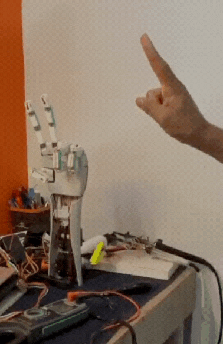

# 🤖 Robotic Hand Gesture Control


---

## 📌 Project Overview

This project implements a **gesture-controlled robotic hand** using computer vision.
Hand gestures are captured via a webcam, processed in real-time, and translated into movements of a physical robotic hand using servo motors.

The system demonstrates **touchless human-machine interaction**, useful in robotics, automation, and assistive technologies.

---

## 🚀 Key Features

* ✋ Real-time hand gesture detection
* 🎯 Accurate finger tracking using MediaPipe
* 🔄 Seamless communication between Python and Arduino
* 🤖 Control of 5 servo motors (one for each finger)
* ⚡ Low-latency response system

---

## 🛠️ Tech Stack

* **Programming Language:** Python
* **Computer Vision:** OpenCV
* **Hand Tracking:** MediaPipe
* **Hardware:** Arduino + Servo Motors
* **Communication:** Serial Communication

---

## ⚙️ System Architecture

1. Webcam captures live video feed
2. MediaPipe detects hand landmarks
3. Python processes finger positions
4. Encoded signals sent via serial to Arduino
5. Arduino controls servo motors accordingly

---

## ▶️ How to Run

### 1️⃣ Clone the Repository

```bash
git clone https://github.com/a-amansharma/robotic-hand-gesture-control.git
cd robotic-hand-gesture-control
```

### 2️⃣ Install Dependencies

```bash
pip3 install -r requirements.txt
```

### 3️⃣ Run the Project

```bash
python3 src/main.py
```

---

## 🔌 Arduino Setup

* Arduino code is located at:
  `/arduino/servo_control.ino`

* Upload the code using Arduino IDE

* Ensure correct **COM port** and **baud rate** are configured

---

## 📂 Project Structure

```
robotic-hand-gesture-control/
│── src/
│── arduino/
│── requirements.txt
│── README.md
```

---

## 📈 Applications

* Assistive devices for physically challenged individuals
* Robotics prototyping
* Human-computer interaction systems
* Automation systems

---

## 👨‍💻 Author

**Aman Sharma**
B.Sc CS (AI) Student

---
# Instagram post
[Click to view](https://www.instagram.com/p/DPZOIejErI8/?utm_source=ig_web_copy_link&igsh=MzRlODBiNWFlZA==)

---

# Linkedln Post
[Click to view](https://www.linkedin.com/posts/a-amansharma_robotics-innovation-teamwork-activity-7379071790259810304-VtCJ?utm_source=share&utm_medium=member_desktop&rcm=ACoAAFMR2VIBzWcU732Hl1HiRdej_YmWsRI29oo)

---

## ⭐ Support

If you found this project useful, consider giving it a ⭐ on GitHub!
